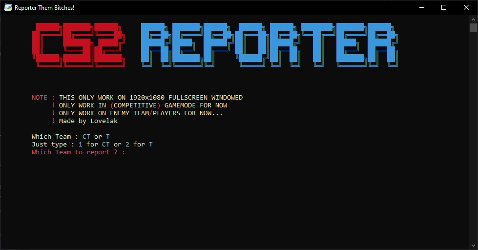

# CS2-Reporter

## Whats New?

## Screenshots



## Description

This script automates the process of reporting players for cheating in CS2. It simulates mouse clicks to navigate the in-game report menu and submit reports for suspected cheaters.

## Features

- **Automated Reporting:** Automatically clicks through the report menu.
- **Team Selection:** Allows you to specify the team (CT or T) of the player you want to report.
- **Player Selection:** Selects the player to report based on their position in the team.
- **Cheat Type Selection:** Reports for WallHacks or AimHacks.
- **Multiple Reports:** Submits multiple reports for the same player.

## Requirements

- Python 3.x
- `pyautogui` library
- `colorama` library

## Installation

1.  Install Python 3.x.
2.  Install the required libraries:

```sh
pip install pyautogui colorama
```

To run :

```sh
python cs2_reporter.py
```
